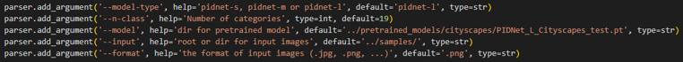

# Oil Pollution Dataset and PIDNet
	
*This is **not** the official repository for [PIDNet](https://github.com/XuJiacong/PIDNet) ([PDF](https://arxiv.org/pdf/2206.02066))*

## What's new
- Without remove logging, we added tqdm for **better visualization** of training, valisation and evaluation
  
- Added output of **precision, recall and F1-score**
- Improved **readability** and versatility of parameters
  
- Improved **file path handling**
- Improved **loading of dataset** (support single image, video, and directory),  added **visualize and show results** during inference

## PIDNet Highlights
<p align="center">
  </br>
  <span align="center">Comparison of inference speed and accuracy for real-time models on test set of Cityscapes.</span> 
</p>

* **Towards Real-time Applications**: PIDNet could be directly used for the real-time applications, such as autonomous vehicle and medical imaging.
* **A Novel Three-branch Network**: Addtional boundary branch is introduced to two-branch network to mimic the PID controller architecture and remedy the overshoot issue of previous models.
* **More Accurate and Faster**: PIDNet-S presents 78.6% mIOU with speed of 93.2 FPS on Cityscapes test set and 80.1% mIOU with speed of 153.7 FPS on CamVid test set. Also, PIDNet-L becomes the most accurate one (80.6% mIOU) among all the real-time networks for Cityscapes.

## Demos

A demo of the segmentation performance of PIDNets with our dataset: Original video (left) and predictions of PIDNet-S (right)
<p align="center">
  </br>
  <span align="center">Oil Pollution Sementic Segmentation demo video</span>
</p>

## Overview
<p align="center">
  </br>
  <span align="center">An overview of the basic architecture of Proportional-Integral-Derivative Network (PIDNet). </span> 
</p>
P, I and D branches are responsiable for detail preservation, context embedding and boundary detection, respectively.

## Models
For simple reproduction, here provided the ImageNet pretrained models.
Also, the finetuned models on Oil Pollution are available for direct application in marine oil pollution detection.

| Model | Links |
| :-: | :-: |
| ImageNet Pretrained | [PIDNet-S](https://drive.google.com/file/d/1hIBp_8maRr60-B3PF0NVtaA6TYBvO4y-/view?usp=sharing) |
| Finetuned Oil Pollution | [PIDNet-S](https://ntutcc-my.sharepoint.com/:u:/g/personal/111598401_cc_ntut_edu_tw/EeCUhUsx0dVKgBW-zx5nJy4BpdP9SEf7JzLhyeCfyWIj6A?e=vxkusi) |

## Evaluation Data
| Data Augmentation | Mean IoU (%) | Pixel Accuracy (%) | Mean Accuracy (%) |
| :---------------- | :----------: | :----------------: | :---------------: |
| NA                | 78.71        | 94.94              | 86.80             |
| HSV               | 85.71        | 96.54              | 93.30             |
| HSV & MBA         | 86.63        | 96.72              | 93.69             |

| Data Augmentation | Class IoUs (%)<br/> \| Sky \| Ship \| Ocean \| Wave \| Shore \| Oil \| Mean \| |
| :---------------- | :----------------------------------------------------------------------------: |
| NA                | \| 94.85 \| 89.80 \| 93.88 \| 57.42 \| 73.99 \| 62.34 \| 78.71 \|              |
| HSV               | \| 96.22 \| 94.33 \| 95.64 \| 64.14 \| 89.54 \| 74.40 \| 85.71 \|              |
| HSV & MBA         | \| 96.44 \| 94.45 \| 95.84 \| 65.71 \| 91.60 \| 75.72 \| 86.63 \|              |

<!-- | Data Augmentation | Precisions <br/> \| Sky \| Ship \| Ocean \| Wave \| Shore \| Oil \| Mean \| |
| :---------------- | :-------------------------------------------------------------------------: |
| NA                | \| 0.986 \| 0.984 \| 0.965 \| 0.746 \| 0.757 \| 0.770 \| 0.868 \|           |
| HSV               | \| 0.982 \| 0.983 \| 0.971 \| 0.783 \| 0.976 \| 0.902 \| 0.933 \|           |
| HSV & MBA         | \| 0.981 \| 0.977 \| 0.972 \| 0.788 \| 0.978 \| 0.924 \| 0.937 \|           |

| Data Augmentation | Recalls <br/> \| Sky \| Ship \| Ocean \| Wave \| Shore \| Oil \| Mean \| |
| :---------------- | :----------------------------------------------------------------------: |
| NA                | \| 0.961 \| 0.911 \| 0.972 \| 0.714 \| 0.970 \| 0.766 \| 0.882 \|        |
| HSV               | \| 0.979 \| 0.959 \| 0.984 \| 0.780 \| 0.916 \| 0.809 \| 0.905 \|        |
| HSV & MBA         | \| 0.983 \| 0.965 \| 0.985 \| 0.798 \| 0.935 \| 0.807 \| 0.912 \|        | -->

| Data Augmentation | F1-Scores <br/> \| Sky \| Ship \| Ocean \| Wave \| Shore \| Oil \| Mean \| |
| :---------------- | :------------------------------------------------------------------------: |
| NA                | \| 0.973 \| 0.946 \| 0.968 \| 0.729 \| 0.850 \| 0.768 \| 0.873 \|          |
| HSV               | \| 0.981 \| 0.971 \| 0.978 \| 0.782 \| 0.945 \| 0.853 \| 0.918 \|          |
| HSV & MBA         | \| 0.982 \| 0.971 \| 0.979 \| 0.793 \| 0.956 \| 0.862 \| 0.923 \|          | 


## Oil Pollution Dataset
| Oil Pollution Dataset | Links |
| :-: | :-: |
| Dataset | [Download](https://ntutcc-my.sharepoint.com/:u:/g/personal/111598401_cc_ntut_edu_tw/Ed_Ye-Y6osJJlyW1Vr8MNTABH9m9wPQ8i8hUdRBl70Gukw?e=k2YQ9L) |
| Config | [Download](https://ntutcc-my.sharepoint.com/:u:/g/personal/111598401_cc_ntut_edu_tw/EeVjZAVXEoNEkXnUPUJhicsBYOLhLmR2Mm8xffY5x3k2Cg?e=ojfJ1E) |

| ClassName | Label |
|:---------:|:-----:|
|  sky      |  19   |
| ship      |  20   |
| ocean     |  21   |
| wave      |  22   |
| shore     |  23   |
|  oil      |  24   |

### Hue Color Space Data Augmentation
* Converts the hue value of *the oil part by gamma correction* so that it can be adjusted to other colors
<p align="center">
  </br>
  <span align="center">Gamma Correction as Data Augmentation</span> 
</p>

### Why hue?
  * By presenting the distribution of HSV values to compare whether effective data augmentation can be achieved by modifying the Hue values

<p align="center">
</br>
As you can see, our training data set has the most concentrated distribution of hues, so we decided to augment the data for the best results by targeting hues
</p>

### Mixing Background Augmentation (MBA)
* This data augmentation method was proposed by LIGHT-WEIGHT MIXED STAGE PARTIAL NETWORK FOR SURVEILLANCE OBJECT DETECTION WITH BACKGROUND DATA AUGMENTATION ([pdf](https://ieeexplore.ieee.org/stamp/stamp.jsp?tp=&arnumber=9506212&tag=1))
* To include foreground information obtained
by background subtraction to generate more training samples
so that the learner can learn important features only around
foreground objects.
<p align="center">
</br>
Mixing Background and original image from α = 10% to 30%
</p>

## Usage
### 0. Prepare the dataset
* Clone this repository or [offical repository](https://github.com/XuJiacong/PIDNet)
* Download the [OilPollution](https://ntutcc-my.sharepoint.com/:u:/g/personal/111598401_cc_ntut_edu_tw/Ed_Ye-Y6osJJlyW1Vr8MNTABH9m9wPQ8i8hUdRBl70Gukw?e=yN1T30)   datasets and [configuration](https://ntutcc-my.sharepoint.com/:u:/g/personal/111598401_cc_ntut_edu_tw/EeVjZAVXEoNEkXnUPUJhicsBYOLhLmR2Mm8xffY5x3k2Cg?e=ojfJ1E) files, unzip them and replace in `root` dir.
* Check if the paths contained in lists of `data/list` are correct for dataset images.

### 1. Training

* Download the [ImageNet pretrained models](https://drive.google.com/file/d/1hIBp_8maRr60-B3PF0NVtaA6TYBvO4y-/view?usp=sharing) and put them into `pretrained_models/imagenet/` dir.
* For example, train the PIDNet-S on OilPollution with on 2 GPUs:
````bash
python3 tools/train.py --cfg configs/oilpollution/pidnet_small_oil_HSV_MBA.yaml GPUS "(0,1)"
````

### 2. Evaluation
* Evaluate pretrained PIDNet-S with oil pollution dataset
````
python3 tools/eval.py --cfg configs/oilpollution/pidnet_small_oil_HSV_MBA.yaml TEST.MODEL_FILE output/oilpollution/pidnet_small_oil_HSV_MBA/best.pt
````

### 3. Speed Measurement
* check [offical repository](https://github.com/XuJiacong/PIDNet)

### 4. Custom Inputs

* Put all your images in `samples/` and then run the command below using OilPollution pretrained PIDNet-S for all files in `samples`/:
````bash
python3 tools/custom.py --model-type 'pidnet-s' --model output/oilpollution/pidnet_small_oil_HSV_MBA/best.pt --input samples --n-class 6
````
* Using OilPollution pretrained PIDNet-L for all files in `samples/` and show visualized results:
````bash
python3 tools/custom.py --model-type 'pidnet-l' --model output/oilpollution/pidnet_small_oil_HSV_MBA/best.pt --input samples --n-class 6 --visualize --show
````

## Acknowledgement

* Our implementation is based on [PIDNet: A Real-time Semantic Segmentation Network Inspired from PID Controller](https://github.com/XuJiacong/PIDNet).
* Thanks for their nice contribution.

