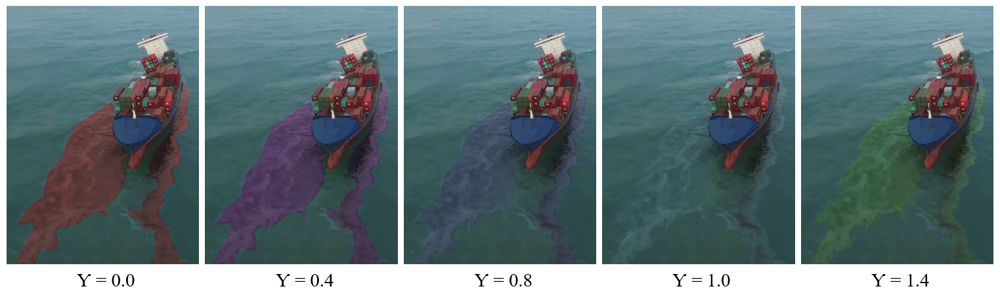

# Oil Polution Dataset with PIDNet
	
*This is **not** the official repository for [PIDNet](https://github.com/XuJiacong/PIDNet) ([PDF](https://arxiv.org/pdf/2206.02066))*

## PIDNet Highlights
<p align="center">
  </br>
  <span align="center">Comparison of inference speed and accuracy for real-time models on test set of Cityscapes.</span> 
</p>

* **Towards Real-time Applications**: PIDNet could be directly used for the real-time applications, such as autonomous vehicle and medical imaging.
* **A Novel Three-branch Network**: Addtional boundary branch is introduced to two-branch network to mimic the PID controller architecture and remedy the overshoot issue of previous models.
* **More Accurate and Faster**: PIDNet-S presents 78.6% mIOU with speed of 93.2 FPS on Cityscapes test set and 80.1% mIOU with speed of 153.7 FPS on CamVid test set. Also, PIDNet-L becomes the most accurate one (80.6% mIOU) among all the real-time networks for Cityscapes.

## Demos

A demo of the segmentation performance of PIDNets with our dataset: Original video (left) and predictions of PIDNet-S (right)
<p align="center">
  </br>
  <span align="center">Oil Polution Sementic Segmentation demo video</span>
</p>

## Overview
<p align="center">
  </br>
  <span align="center">An overview of the basic architecture of Proportional-Integral-Derivative Network (PIDNet). </span> 
</p>
P, I and D branches are responsiable for detail preservation, context embedding and boundary detection, respectively.

## Models
For simple reproduction, here provided the ImageNet pretrained models.
Also, the finetuned models on Oil Polution are available for direct application in marine oil polution detection.

| Model | Links |
| :-: | :-: |
| ImageNet Pretrained | [PIDNet-S](https://drive.google.com/file/d/1hIBp_8maRr60-B3PF0NVtaA6TYBvO4y-/view?usp=sharing) |
| Finetuned Oil Polution | [PIDNet-S](https://ntutcc-my.sharepoint.com/:u:/g/personal/111598401_cc_ntut_edu_tw/EeCUhUsx0dVKgBW-zx5nJy4BpdP9SEf7JzLhyeCfyWIj6A?e=vxkusi) |

| Oil Polution Dataset | Links |
| :-: | :-: |
| Dataset | [Download](https://ntutcc-my.sharepoint.com/:u:/g/personal/111598401_cc_ntut_edu_tw/Ed_Ye-Y6osJJlyW1Vr8MNTABH9m9wPQ8i8hUdRBl70Gukw?e=k2YQ9L) |
| Config | [Download](https://ntutcc-my.sharepoint.com/:u:/g/personal/111598401_cc_ntut_edu_tw/EeVjZAVXEoNEkXnUPUJhicsBYOLhLmR2Mm8xffY5x3k2Cg?e=ojfJ1E) |

## Oil Polution Dataset
### Hue Color Space Data Augmentation
* Converts the hue value of *the oil part by gamma correction* so that it can be adjusted to other colors
<p align="center">
  </br>
  <span align="center">Gamma Correction as Data Augmentation</span> 
</p>

### Why hue?
  * By presenting the distribution of HSV values to compare whether effective data augmentation can be achieved by modifying the Hue values

<p align="center">
</br>
As you can see, our training data set has the most concentrated distribution of hues, so we decided to augment the data for the best results by targeting hues
</p>

### Mixing Background Augmentation (MBA)
* This data augmentation method was proposed by LIGHT-WEIGHT MIXED STAGE PARTIAL NETWORK FOR SURVEILLANCE OBJECT DETECTION WITH BACKGROUND DATA AUGMENTATION ([pdf](https://ieeexplore.ieee.org/stamp/stamp.jsp?tp=&arnumber=9506212&tag=1))
* To include foreground information obtained
by background subtraction to generate more training samples
so that the learner can learn important features only around
foreground objects.
<p align="center">
</br>
Mixing Background and original image from α = 10% to 30%
</p>

## Usage
### 0. Prepare the dataset
* Clone [offical repository](https://github.com/XuJiacong/PIDNet)
* Download the [OilPolution](https://ntutcc-my.sharepoint.com/:u:/g/personal/111598401_cc_ntut_edu_tw/Ed_Ye-Y6osJJlyW1Vr8MNTABH9m9wPQ8i8hUdRBl70Gukw?e=k2YQ9L)   datasets and [configuration](https://ntutcc-my.sharepoint.com/:u:/g/personal/111598401_cc_ntut_edu_tw/EeVjZAVXEoNEkXnUPUJhicsBYOLhLmR2Mm8xffY5x3k2Cg?e=ojfJ1E) files, unzip them and replace in `root` dir.
* Check if the paths contained in lists of `data/list` are correct for dataset images.

### 1. Training

* Download the [ImageNet pretrained models](https://drive.google.com/file/d/1hIBp_8maRr60-B3PF0NVtaA6TYBvO4y-/view?usp=sharing) and put them into `pretrained_models/imagenet/` dir.
* For example, train the PIDNet-S on OilPolution with batch size of 12 on 2 GPUs:
````bash
python tools/train.py --cfg configs/oilpolution/pidnet_small_MBA_HSV_AUG_S.yaml GPUS (0,1) TRAIN.BATCH_SIZE_PER_GPU 6
````

### 2. Evaluation & Speed Measurement

* check [offical repository](https://github.com/XuJiacong/PIDNet)

### 4. Custom Inputs

* Put all your images in `samples/` and then run the command below using OilPolution pretrained PIDNet-S for image format of .jpg:
````bash
python tools/custom.py --a pidnet-s --p output/oilpolution/pidnet_small_MBA_HSV_AUG_S/best.pt --t .jpg --r samples\
````

## Acknowledgement

* Our implementation is based on [PIDNet: A Real-time Semantic Segmentation Network Inspired from PID Controller](https://github.com/XuJiacong/PIDNet).
* Thanks for their nice contribution.

